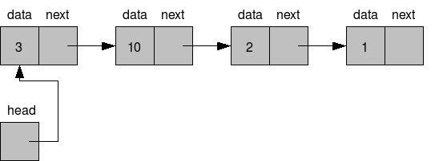

## 연결리스트

연결 리스트란 배열과 비슷한 선형 연결 구조를 가지고 있습니다. 파이썬의 List처럼 직접 연결한 것이 아닌 현재 노드와 다음 노드의 순서를 연결한 형태입니다. 연결 리스트에는 단일 연결 리스트, 이중 연결 리스트가 있습니다.

### 단일 연결 리스트



단일 연결리스트는 위와 같이 데이터와 그 다음 노드가 어디인지를 저장해놓는 구조를 가지고 있습니다. 따라서 데이터의 삽입과 삭제가 굉장히 유용합니다. 하지만 중간에 껴있는 노드에 접근하려면 head로 부터 하나하나 단일 연결 리스트 전체를 탐색해야 하므로 시간이 오래걸리며 어떤 노드의 이전 노드를 탐색하는 것도 어렵습니다.

### 파이썬으로 단일 연결 리스트 구현하기

1. 노드는 노드 데이터와 다음 노드의 정보를 가지고 있음
2. 연결 리스트는 노드의 헤드 정보만 가지고 있음
3. 연결 리스트의 추가, 삭제, 보여주기 구현

```python
class Node:
    def __init__(self, data):
        self.data = data
        self.next = None

class singly_linked_list:
    def __init__(self):
        self.head = None
```

기본적인 노드와 연결 리스트의 구성입니다. 노드는 데이터 값과 다음 노드의 위치를 알고 연결 리스트는 시작 점이 어디인지만 알고 있습니다.

```python
 def append(self, node):
        if self.head == None:
            self.head = node

        else:
            currentNode = self.head
            while currentNode.next != None:
                currentNode = currentNode.next
            currentNode.next = node
```

기본적인 추가 메소드입니다. 가장 마지막 자리에 노드를 삽입합니다. 만약 노드가 비었을 경우(self.head == None) 이 노드를 노드의 시작점으로 정의해줍니다.

```python
    def show(self):
        if self.head == None:
            raise Exception("List is Empty")
        else:
            currentNode = self.head
            while currentNode != None:
                print(currentNode.data)
                currentNode = currentNode.next
```

노드를 전체적으로 보여줍니다. 노드의 끝까지(node.next == None 일 때 까지) 노드의 데이터를 print해줍니다.

```python
    def insertByIdx(self, node, idx):
        if self.head == None:
            raise Exception('List is Empty')

        else:
            if idx == 0:
                node.next = self.head
                self.head = node
            else:
                currentNode = self.head
                currentIdx = 0
                while currentNode.next != None:
                    currentNode = currentNode.next
                    currentIdx = currentIdx + 1
                    if(currentIdx == idx-1):
                        node.next = currentNode.next
                        currentNode.next = node
                        break

    def deleteByIdx(self, idx):
        if self.head == None:
            raise Exception("List is Empty")
        else:
            currentIdx = 0
            currentNode = self.head
            while currentNode.next != None:
                if(currentIdx == idx-1):
                    prevNode = currentNode
                    currentNode = prevNode.next
                    nextNode = currentNode.next
                    prevNode.next = nextNode
                    break
                else:
                    currentNode = currentNode.next
                    currentIdx = currentIdx + 1
```

이제 원하는 위치에 데이터를 삽입 또는 삭제하는 메소드입니다. 연결 리스트의 시작부터 끝까지 하나하나 훑으면서 맞는 idx에 도착할 경우 그 자리에 노드를 삽입합니다.

만약 삽입의 경우에는 삽입할 인덱스에 도달할 경우 추가할 노드의 next를 이전 노드의 next로 설정하고 이전 노드의 next는 추가할 노드 자신을 향하도록 합니다.

삭제의 경우에는 맞는 인덱스에 도달할 경우 삭제하기 이전(prevNode)의 next를 삭제할 인덱스의 next로 지정하여 한 칸 당겨주면 됩니다.

## 이중 연결 리스트

이중 연결리스트는 노드의 데이터, 이전 노드의 정보와 다음 노드의 정보도 가지고 있습니다.


위와 같은 구조를 가지고 있는 이중 연결 리스트는 이전 노드를 보여줄 수 있고 특정 노드의 앞 뒤로 삽입 및 삭제하는 과정이 간단해집니다. 하지만 Node 자체가 이전 노드의 정보를 가져야 하므로 연결 리스트 이용의 목적에 따라 이중 연결 리스트가 불필요한 경우도 있습니다.

### 파이썬으로 이중 연결 리스트 구현하기

1. 노드를 원하는 곳에 삽입 및 삭제하기
2. 연결 리스트 보여주기

```python
class Node:
    def __init__(self, data):
        self.next = None
        self.prev = None
        self.data = data

class double_linked_list:
    def __init__(self):
        self.head = None

    def append(self, node):
        if(self.head == None):
            self.head = node
        else:
            currentNode = self.head
            while currentNode.next != None:
                currentNode = currentNode.next
            node.prev = currentNode
            currentNode.next = node

    def show(self):
        if(self.head == None):
            raise Exception('List is empty')
        else:
            currentNode = self.head
            print(currentNode.data)
            while(currentNode.next != None):
                currentNode = currentNode.next
                print(currentNode.data)

```

파이썬으로 구현을 하다보니 이전 노드에 접근할 수 있는 것 말고는 탐색에 있어서 장점을 가지려면 prev를 이용해야 하고 결국 거꾸로 탐색하는 메소드를 작성해야 했다. 거꾸로 탐색하는 메소드를 이용하기 위한 조건은 전체 사이즈에 따라 나누어야 했고 결국 전체 사이즈를 세는 메소드가 필요하다.

```python
    def size(self):
        if self.head == None:
            return 0
        else:
            count = 1
            currentNode = self.head
            while currentNode.next != None:
                count = count + 1
                currentNode = currentNode.next
            return count
```

## 일반적인 배열과 연결 리스트의 차이

배열과 연결리스트는 데이터를 순차적으로 저장하다는 특징은 같다. 배열은 데이터를 물리적 주소 또한 순차적이도록 저장하고 인덱스를
가지고 있어서 특정 데이터에 대한 접근이 빠르다. 하지만 삽입, 삭제에 있어서는 삽입, 삭제 이 후 모든 데이터의 위치를 바꾸기 때문에
불리하다. 연결 리스트는 노드의 이전, 다음 노드를 저장하기 때문에 물리적으로는 순차적이지 않다. 하지만 삽입과 삭제에 있어서 논리적인
주소만 바꾸기 때문에 유리한 특징을 가지고 있다. 단 탐색 시에는 단일, 이중 연결리스트 모두 처음부터 순차적으로 탐색해야 하므로 탐색
에서 불리하다.
